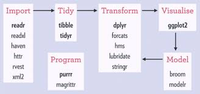

# DS week12 IP Project-Wrangle-and-Analyze-Data with-R

# Problem Statement:

## Data sources

This project involves the data wrangling work for Data using R programming language.

    
[Dataset](https://github.com/abel-keya/Data-Wrangling-with-R/blob/master/advertising.csv)

# Description

In this project it is required to:

(i)     Define the question, the metric for success, the context, experimental design taken and the appropriateness of the available data to answer the given question.

(ii)    Find and deal with outliers, anomalies, and missing data within the dataset.

(iii)   Perform  univariate and bivariate analysis.

(iv)    From your insights provide a conclusion and recommendation.

NB: Your final deliverable will be either an markdown document,  which will comprise the above sections;

The master dataset is analyzed using R data science language in the R Notebook 

# Context

A Kenyan entrepreneur has created an online cryptography course and would want to advertise it on her blog. She currently targets audiences originating from various countries. In the past, she ran ads to advertise a related course on the same blog and collected data in the process. She would now like to employ your services as a Data Science Consultant to help her identify which individuals are most likely to click on her ads. 

# Requirements

* Anaconda installation
* Base R language
* Rstudio

* Setup instruction

> * Save a copy of the notebook/R markdown file in your drive and open it to access.

   
   # R Packages used:
   
 
 
   
  
  
  
 

# Support
In case of any clarifications or suggestions with regards to this project email me at jumakeya@gmail.com

License
Copyright (c) 2020 **Abel Keya**
